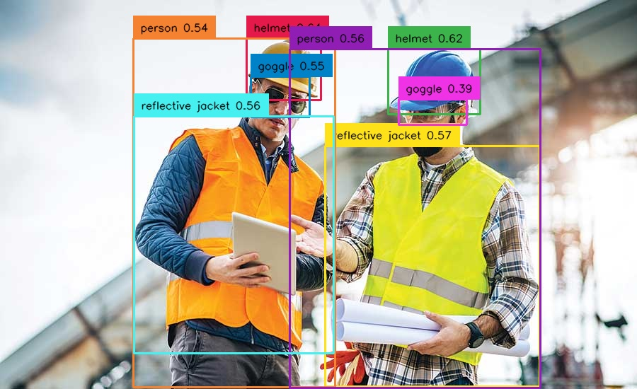

# GroundingDino Auto Annotation

 <!-- Optional: Include a logo or illustration of your project -->

## Overview

GroundingDino Auto Annotation is a computer vision project aimed at automating the annotation process for image datasets. This project leverages state-of-the-art object detection models to generate bounding box annotations for objects within images.

### Features

- Automated object detection and annotation.
- Supports multiple object detection.
- Export annotations in Pascal VOC XML format.
- Compatible with various image datasets.

## Table of Contents

1. [Installation](#installation)

## Installation

<!-- Provide instructions on how to install and set up your project. Include any dependencies and system requirements. -->

To install GroundingDino Auto Annotation, follow these steps:

1. Clone the repository to your local machine:

   ```bash
   git clone https://github.com/anil2k/groundingdino-auto-annotation.git
